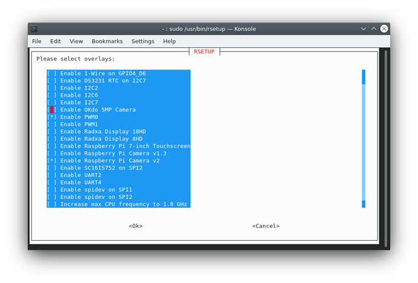

# Caminja
Boat electronics centered project for our sailboat a 1975 Maxi 95 named "Caminja"

## Hardware
Garmin gWind wired masthead windsensor\
\
Garmin GND10 NMEA0183 to NMEA2000 and USB gateway\
\
Garmin GMI20 Colour Graphical Multi Instrument\
\
Airmar DST200 Depth, Speed and water temperature sensor\
\
Garmin NMEA2000 network backbone (standard Micro-C)\
\
Raymarine Axiom 9 Plotter MFD\
\
ROCK 4SE SBC with PICAN-M NMEA2000 NMEA0183 and i2c Hat with SMPS
https://www.skpang.co.uk/products/pican-m-with-can-bus-micro-c-and-rs422-connector-3a-smps


## Software
OS for ROCK 4SE SBC: Debian 11\
https://forum.radxa.com/t/230315-system-release-notice-for-rock-4-family/15306\
https://wiki.radxa.com/Rockpi4/Debian\
https://github.com/radxa-build/rock-4se/releases\

### Scripts, Setup and Configuration

Many of the guides to integrating shields and other periferal modules to Raspberry Pis refers to adding overlays in ```/boot/config.txt```
```
sudo nano /boot/config.txt

Add	these	lines	to	the	end	of	file:
dtparam=i2c_arm=on
dtparam=spi=on
dtoverlay=mcp2515-can0,oscillator=16000000,interrupt=25
dtoverlay=spi-bcm2835-overlay 
```

The Debian 11 release for the ROCK 4SE board has a utility called ```rsetup``` to enable/disable Device Tree Overlays, as well as other system settings and options.
and the configuration files in the os greet you with a message of retirement and point you towards ```rsetup``` instead.



This ```rsetup``` tool is restricted to the compiled ".dtb" that ships with the OS. There is, however, an option to add overlays from source. This means you can create your own or user someone else's Device Tree Overlay Source ```.dts``` file and import this in ```rsetup``` which then compiles it and makes it available in the menu on the next reboot.

In our case we need to be able to use with the MCP2515 SPI to CAN interface on the PICAN-M Hat and expose this as a Canbus ```can0``` port to the user.

Thanks to a much helpful post on armbian by user csirke:
https://forum.armbian.com/topic/24086-rockpi4b-with-mcp2515/

We have a Device tree overlay source that should work for our application:

```
//This devicetree overlay is used for mcp2515 CAN HAT.
/dts-v1/;
/plugin/;

/ {
	compatible = "rockchip,rockpi","rockchip,rk3399";

	fragment@0 {
		target = <&pinctrl>;

		__overlay__ {
			mcp2515_pins {
				mcp2515_int_pin: mcp2515_int_pin {
				rockchip,pins = <4 29 0 &pcfg_pull_none>;
				};
			};
		};		
	};

	fragment@1 {
		target-path = "/";

		__overlay__ {
			can_mcp2515_osc: can-mcp2515-osc {
				compatible = "fixed-clock";
				clock-frequency = <16000000>;
				#clock-cells = <0>;
			};
		};
	};

	fragment@2 {
		target = <&spi1>;

		__overlay__ {
			status = "okay";
			max-freq = <1000000>;
			#address-cells = <1>;
			#size-cells = <0>;

			can_mcp2515: can-mcp2515@0 {
				status = "okay";
				compatible = "microchip,mcp2515";
				reg = <0>;
				interrupt-parent = <&gpio4>;
				interrupts = <29 2>;
				spi-max-frequency = <1000000>;
				clocks = <&can_mcp2515_osc>;
				vdd-supply = <&vcc3v3_sys>;
				xceiver-supply = <&vcc3v3_sys>;
				pinctrl-names = "default";
				pinctrl-0 = <&mcp2515_int_pin>;
			};
		};
	};
};
```
With this option enabled in ```rsetup``` we should be able to make a connection on can0 and start seeing data streaming in!

Following the guide on SeaBits[^1]

```
sudo apt-get install can-utils -y
```
```
Then we need to bring up the CAN-bus/NMEA 2000 interface
```
sudo /sbin/ip link set can0 up type can bitrate 250000
```
We also want to add this to a startup script so that the command is run every time the system reboots. You'll need to create the following file and copy it into /etc/
systemd/system.
```
nano socketcan-interface.service
```

Paste the contents of the below into the file. Press Control-X to save and exit.
```
[Unit]
Description=SocketCAN interface can0 with a baudrate of 250000
[Service]
Type=oneshot
RemainAfterExit=yes
ExecStart=/sbin/ip link set can0 type can bitrate 250000 ; /sbin/ifconfig can0 up
ExecReload=/sbin/ifconfig can0 down ; /sbin/ip link set can0 type can bitrate 250000 ; /sbin/ifconfig can0 up
ExecStop=/sbin/ifconfig can0 down
[Install]
WantedBy=multi-user.target
```
Copy the file to the appropriate systemd directory and give it the right permissions
```
sudo cp socketcan-interface.service /etc/systemd/system
sudo chmod 644 /etc/systemd/system/socketcan-interface.service
sudo systemctl enable socketcan-interface.service
```
In my case ```ifconfig``` was missing and required me to install ```net-tools```

```
sudo apt install net-tools
``` 

To test that things are working correctly, you can use the command candump and see the raw traffic from the NMEA 2000 network.

Warning that this can be a lot of data – to get out of it, press Control-C

```
candump can0
```
And just like that! A stream of CAN/NMEA2000 data pouring in!

## References and Further reading
[^1]: https://seabits.com/nmea-2000-powered-raspberry-pi/

https://seabits.com/nmea-2000-powered-raspberry-pi/

https://open-boat-projects.org/en/pican-m-mit-signalk-und-openplotter/

https://seabits.com/set-up-signal-k-and-grafana-on-raspberry-pi-with-pican-m-nmea-2000-board/
